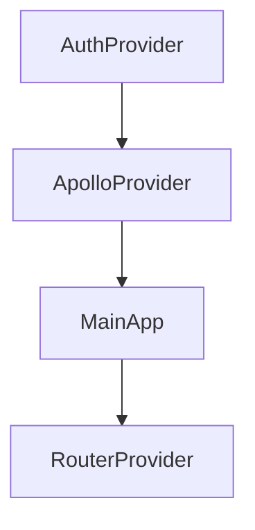

keywords: auth, routing, logto, permify

# App Structure

# File-based routing

The `router` object passed into react-router-dom's `RouterProvider` is generated dynamically. There are "Public Routes" and "Protected Routes". 

## Public Routes

Files in the pages directory  export an `access` variable with value `public` will be treated as a public route. (*/pages/public.tsx*)

# Authentication Flow

