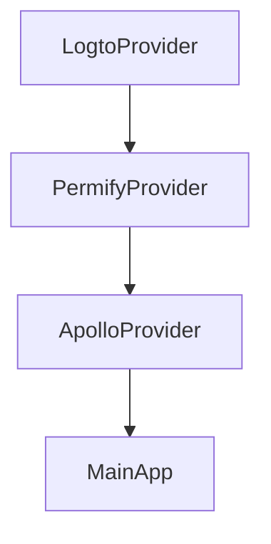
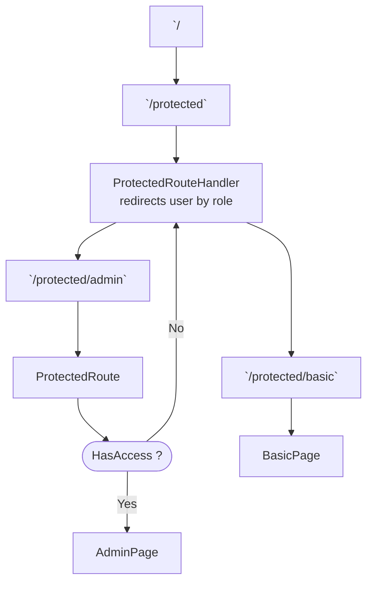

# App Structure



PermifyProvider tracks the state of the user's roles and permissions

# Navigating to Authorized Route

1. User Logs in via Logto Auth Flow.
2. User is redirected to the App to the /callback route, `useInitializePermify` hook is called to set the user ID and user roles in the PermifyContext
3. User is directed from /callback to /home
4. User is now authenticated
5. User navigates to protected route, e.g. /protected
6. Using Permify's `isAuthorized` hook, the user's authorization is checked.
7. Since User has role "administrator", User is redirected to /protected/administrator

# File-based routing

The `router` object passed into react-router-dom's `RouterProvider` is generated dynamically using files in the `/pages` directory. There are "Public Route" files and "Protected Route" files, which are defined by an exported variable called `access` that can have a value of "public" or "private".

_see: `router.tsx`_

## Public Routes

Files in the pages directory export an `access` variable with value `"public"` will be treated as a public route. (_/pages/public.tsx_)

Additionally, the file should export a single react component.

a public route is represented by a react-router RouteObject.

## Protected Routes

Files in the pages directory export an `access` variable with value `"protected"` will be treated as a protected route. (_/pages/protected.tsx_).

Additionally, a protected route file should export a routeMap of type `Array<[RoleName, JSX.Element]>` which represents available views and the corresponding roles that have access to them.

Each element in the routeMap array be rendered as the <Outlet /> of a `ProtectedRoute` component

```ts
{
   path: "admin",
   element: <ProtectedRoute allowedRoles={["admin"]} />
   children: [{ index: true, element: <AdminPage /> }],
}
   // "admin" from RoleName, <AdminPage /> from JSX.Element
```

# ProtectedRouteHandler

```ts
({ roles }: { role: Array<Role> }) => JSX.Element;
```

Redirects the user to the appropriate subroute. The component takes the array of roles, filters out the unauthorized roles, sorts them by a role priority order defined in the application, and returns the first role. The name of the role is used as a subpath to which the user is navigated.

If the base of the protected role is /community, and the resolved role is "administrator", the user will be redirected to /community/administrator

# Route Example


