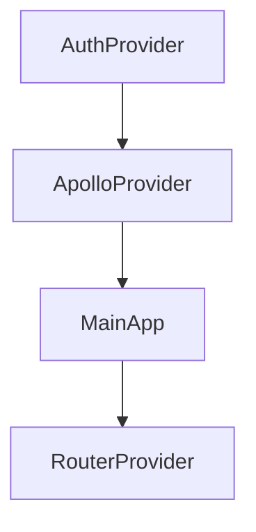
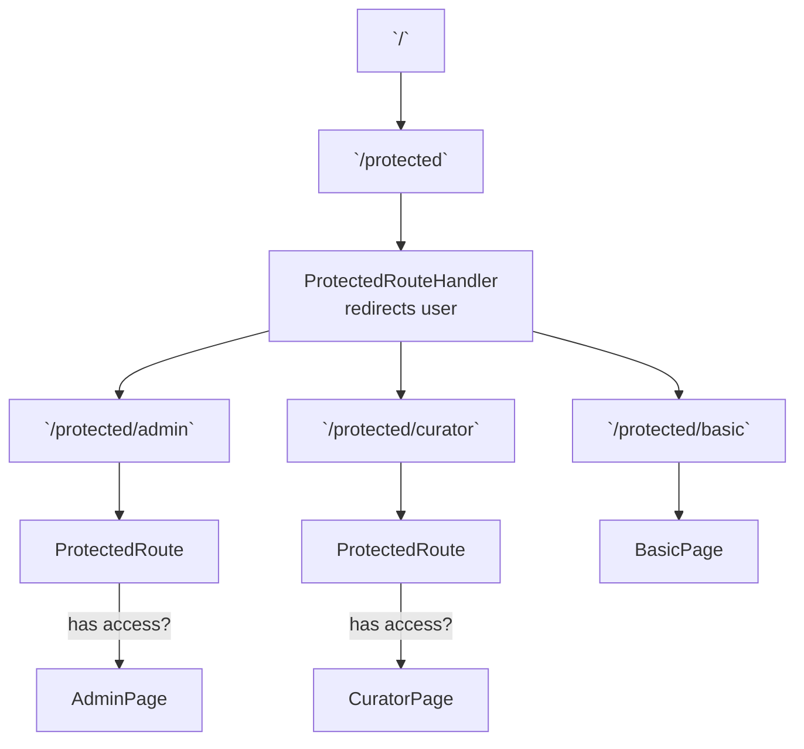

!!TODO: handle back navigation from protected route

# App Structure

# File-based routing 

The `router` object passed into react-router-dom's `RouterProvider` is generated dynamically. There are "Public Routes" and "Protected Routes". 

....

## Public Routes 

Files in the pages directory export an `access` variable with value `"public"` will be treated as a public route. (*/pages/public.tsx*)

Additionally, a public route file should export a single react component.

a public route is represented by a react-router RouteObject.

## Protected Routes

Files in the pages directory  export an `access` variable with value `"protected"` will be treated as a protected route. (*/pages/protected.tsx*).

Additionally, a protected route file should export a role-to-view map of type `Array<[RoleName, JSX.Element]>` which represents available views and corresponding roles that have access to them. 

This array will be mapped to create an array of react-router  `RouteObject`s 

# Example

