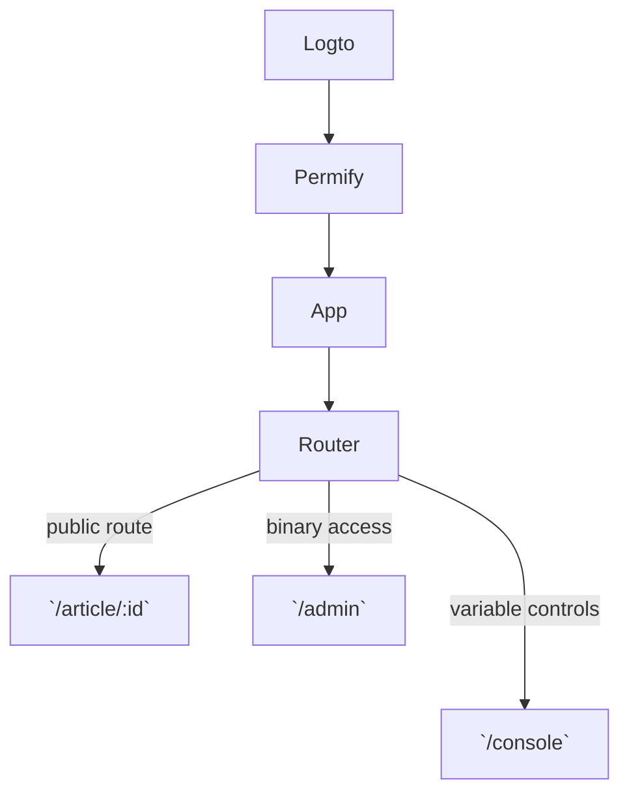

Project for implementing role-based views. 
keywords: react-router-dom, logto, permify, role-based access, permissions

# Design Goals

1. Page Views should be unaware of Auth state when possible
    
2. Role-to-view decision should be done by react-router-dom?

3. Fetching role / permission data be delegated to a react-router data loader?

# Flow

1. User opens app

2. User logs in 

3. Logto auth flow

4. App receives Logto data 

5. 

